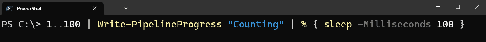

# PSProgress

PSProgress is a PowerShell module that provides a cmdlet to make writing progress easier. This module aims to simplify the process of creating and managing progress bars in your PowerShell scripts.



## Features

- **Easy-to-use**: Simplify the creation of progress bars.
- **Performance monitoring**: Track the progress of your scripts with minimal overhead.

## Installation

You can install the `PSProgress` module from the PowerShell Gallery using the following command:

```powershell
Install-Module -Name PSProgress -Scope CurrentUser
```

## Getting Started

Here are some basic examples to get you started with `PSProgress`:

### Example 1: Simple Progress Bar

```powershell
1..10 | Write-PipelineProgress -Activity "Activity" | ForEach-Object {
    # Simulate a task.
    Start-Sleep -Seconds 1
}
```

### Example 2: Custom Progress Status

```powershell
Get-ChildItem *.json -Recurse | Write-PipelineProgress -Activity "Read JSON Files" -Status { $_.Name } | ForEach-Object {
    # Simulate parsing the file.
    Start-Sleep -Seconds 1
}
```

### Example 3: Progress Bar with a Known Number of Items

```powershell
$taskList = 1..1000000
$taskList | Write-PipelineProgress -Activity "Process Many Items" -ExpectedCount $taskList.Count | ForEach-Object {
    # Simulate a task.
    Start-Sleep -Milliseconds 10
}
```

## Cmdlets

### Write-PipelineProgress

**Description**: Displays a progress bar that updates as the items in the pipeline are processed.

#### Syntax

```powershell
Write-PipelineProgress [-InputObject <Object[]>] [-Activity] <String> [-ExpectedCount <Int32>] [-Id <Int32>]
 [-ParentId <Int32>] [-Status <ScriptBlock>] [-CurrentOperation <ScriptBlock>] [-RefreshInterval <TimeSpan>]
 [-DisplayThreshold <TimeSpan>] [-MinimumTimeLeftToDisplay <TimeSpan>] [-ProgressAction <ActionPreference>]
 [<CommonParameters>]
```

#### Parameters:

- **InputObject**: Specifies the input objects. Progress will be written for each of these objects.
- **Activity**: Specifies the first line of text in the heading above the status bar. This text describes the activity whose progress is being reported.
- **ExpectedCount**: Specifies the number of items that are expected to be processed. Using this parameter will improve the speed and reduce the overhead of this command.
- **Id**: Specifies an ID that distinguishes each progress bar from the others. Use this parameter when you are creating more than one progress bar in a single command.
- **ParentId**: Specifies the parent activity of the current activity. Use the value `-1` if the current activity has no parent activity.
- **Status**: Specifies a script block expression that gets text that describes the current state of the activity, given the object being processed.
- **CurrentOperation**: Specifies a script block expression that gets text that describes the operation that's currently taking place.
- **RefreshInterval**: Specifies the interval at which progress should be returned.
- **DisplayThreshold**: Specifies the length of time from the first sample that progress should be returned.
- **MinimumTimeLeftToDisplay**: Specifies the shortest length of time over which progress should be returned.

## Contributing

Contributions are welcome! Please feel free to submit issues or pull requests to help improve `PSProgress`.

## License

This project is licensed under the MIT License - see the [LICENSE](LICENSE) file for details.

## Authors

- [Daniel Potter](https://github.com/DanielPotter)
